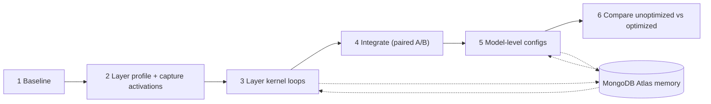

# Visai

**Visai is a self-improving agent that profiles AI models, writes hardware-specific kernels for their bottleneck layers, verifies them against the model's own layers and public task benchmarks, and learns from every experiment so the next run needs less search.**

You give it a model, the machine it runs on, a workload, and a quality budget. It measures the stock model, finds the layers that cost the most time, has an agent iterate on faster kernels for them, keeps only the changes that make the *whole model* faster without hurting quality, then searches model-level settings and reports unoptimized vs optimized head to head. Every trial, lesson, and winning kernel is stored in MongoDB Atlas.

Built at the MongoDB *Harness Engineering & Model Wrangling* hackathon (NYC, Sep 2026) on **MongoDB Atlas** (memory + Vector Search), **OpenRouter** (all model calls), and the **Strands Agents SDK** (agent runtime).

## Results on an Apple M3 Pro (18 GB)

All numbers are unoptimized vs optimized on the same data points, speed measured with interleaved A/B runs.

| Model | Unoptimized | Optimized | Speed | Quality |
|---|---|---|---|---|
| **Qwen3-0.6B** (LLM decode) | 97.4 tok/s, 1.52 GB | **163.1 tok/s, 0.95 GB** | **1.67x**, latency −40% | perplexity 28.00 → 28.25 (+0.88%, budget 1%) |
| **Parakeet-TDT 0.6B v3** (ASR, 10-min meeting) | 40.6x real-time | **47.4x real-time** | **1.17x**, latency −14% | WER 2.46% → 2.46% |
| **Nemotron-3 Diarization** (2 AMI meetings) | DER 35.6% | **DER 15.5%** | ~1.0x (already ~480x real-time) | **held-out meetings: DER 24.6% → 9.2%** |

What produced them:

- **Qwen3-0.6B:** 8-bit weights (group size 64) plus a 4096-token prefill step, found by the model-level agent. The layer kernels it also kept (RMSNorm, RoPE) are roughly neutral end to end.
- **Parakeet:** 5 s chunk overlap instead of 15 s, with WER unchanged. The decoder LSTM kernel reached **4.61x at the layer level**. Measured paired, the LSTM and Conv1d kernels together made the whole model 0.94x, so the final config excludes them.
- **Diarization:** speaker-activity threshold 0.25 with 1.2 s segment merging. Speed was already saturated, so the win is quality. It was validated on two AMI meetings the tuning never saw.

The pattern across all three is the lesson kernel-forge found on CUDA: **isolated layer speedups rarely survive end to end**. That is why Visai gates every kernel on whole-model paired measurements before keeping it.

The dashboard's **Results** tab shows all of this live from Atlas.

## Detailed results

### Layer kernels: isolated vs whole model

"Isolated" is the candidate against the model's own layer on captured real activations (worse of two runs). "Whole model" is the paired A/B end-to-end check against the state before adding that kernel.

| Model | Layer (self time) | Best isolated | Whole model (paired) | Decision |
|---|---|---|---|---|
| Parakeet | LSTM (10.1%) | **4.61x** | 1.08x | kept |
| Parakeet | Conv1d (7.0%) | 1.84x | 1.06x | kept |
| Parakeet | LayerNorm (5.5%) | 1.53x | 0.89x | reverted |
| Qwen3-0.6B | RMSNorm (15.2%) | 1.09x | 1.14x | kept |
| Qwen3-0.6B | RoPE (7.6%) | 1.02x | 1.37x | kept |
| Diarization | LayerNorm (7.2%) | 1.06x | 1.01x | kept |
| Diarization | Attention (15.7%) | 1.03x | — | layer only |

All kept kernels measured together against stock came out at **0.94x** for Parakeet, **0.94x** for Qwen, and **1.00x** for diarization. Step-by-step gains of 5–10% sit inside run-to-run noise and compound. The together-vs-stock measurement is the honest one, so Parakeet's final config drops its layer kernels. Winning kernels are stored in Atlas (`kernels`) with their isolated and end-to-end results.

### Model-level search

- **Qwen3-0.6B:** 8-bit g32 keeping head and down-projection at full precision gave 1.16x (perplexity +0.46%). 8-bit g64 gave 1.32x. The final config, 8-bit g64 on all layers plus a 4096-token prefill, gave **1.67x** at +0.88% perplexity. The agent then declared saturation: it judged the remaining ~30% headroom needs matmul fusion or `mx.compile`, which the config search space doesn't cover. Under an earlier 0.5% budget, 8-bit was rejected at +0.77%.
- **Parakeet:** 8-bit encoder weights measured 1.09x on their own but lost the paired check against the current best. The 5 s chunk overlap was kept. An earlier standalone speech run found 6-bit encoder weights plus 5 s overlap at 1.22x with WER unchanged; that was measured with the older unpaired method and hasn't been re-verified with paired A/B yet.
- **Diarization:** fp16 gave 1.02x (paired, within noise) and 4-bit weights were slower. A large custom streaming chunk was **2.09x faster but doubled DER to 70%**, so the quality gate rejected it and memory blocked it afterwards.

### Diarization post-processing sweep

DER on the tuning set (AMI test meetings 1–2, 20 min), speed unchanged at ~480x real-time throughout:

| threshold / merge gap | 0.5 / 0 (stock) | 0.3 / 0 | 0.3 / 0.3 s | 0.3 / 0.6 s | 0.3 / 0.9 s | **0.25 / 1.2 s** | 0.2 / 1.2 s |
|---|---|---|---|---|---|---|---|
| DER | 35.6% | 33.2% | 31.5% | 27.3% | 21.2% | **15.5%** | 15.6% |

On **held-out** AMI test meetings 3–4, which were never used for tuning, DER went from **24.6% to 9.2%**. The error breakdown:

- missed speech: 22.6% → 4.4%
- false alarms: 1.3% → 3.6%
- speaker confusion: 0.7% → 1.1%

The model had been dropping speakers during short pauses.

### Memory compounding

On Parakeet's decoder LSTM:

- **Cold run:** first candidate 1.16x, best 3.80x after 5 benchmarked candidates.
- **Next run:** retrieved LSTM skills from Atlas (e.g. `cache_weight_dtype_copies_for_mixed_precision_decode`), opened at 2.28x, and reached **4.61x by candidate 3**.
- **A third run:** stopped as soon as it reached the 2x target.

### Caveats

- Running three models in parallel corrupted absolute timings: Qwen's baseline read 29 tok/s against ~95 when run alone. That produced a fake 3.41x "win" before paired A/B measurement was added. The final numbers above were measured one model at a time with paired runs.
- The OpenRouter key hit its spending limit near the end, so the diarization post-processing sweep was driven by the harness rather than the agent. It used the same gates and recording.
- Evaluation slices are small (40 LibriSpeech utterances, 2+2 AMI meetings, ~2k WikiText tokens). They catch real regressions but can't resolve differences much below ~0.1 WER/DER points.

## How it works



1. **Baseline:** the stock model on fixed data points. That means decode tok/s + perplexity for Qwen, real-time factor + WER for Parakeet, and real-time factor + DER for diarization.
2. **Layer profile:** exclusive (self) time per layer class on a real forward pass. Real input activations are captured for the top layers (up to 4 shapes each, including decode shapes).
3. **Layer kernel loops:** each bottleneck layer gets its own loop. Every iteration goes:

   ```mermaid
   flowchart LR
       Writer["Writer agent"] --> Guards["Interventions"]
       Guards --> Gate1["Gate 1: match model's own layer on real + hidden inputs"]
       Gate1 -->|pass| Bench["Benchmark x2 vs original"]
       Gate1 -->|fail| Writer
       Bench --> Reflect["Record + Reflect agent"]
       Reflect --> Memory[("Atlas")]
       Memory --> Writer
   ```

4. **Integrate:** each layer winner goes into the whole model. It is kept only if interleaved A/B runs show the model got faster and quality stayed within budget.
5. **Model level:** an agent searches deployment configs on top of the kept kernels: quantization bits and group size, mixed precision, dtype, KV-cache quantization, chunking, and streaming or post-processing settings.
6. **Compare:** stock vs final config, paired, stored in the `comparisons` collection.

### The harness (plain Python) owns the rules

| Rule | What it means |
|---|---|
| **Budgets** | Per iteration: at most 4 correctness runs, 2 benchmarks, 12 tool calls, and one idea. Per stage: iteration and minute caps. |
| **Gate 1 (correctness)** | The candidate must reproduce the model's own layer on captured activations plus hidden x3 / x0.01 / negated / noise inputs. It runs in a subprocess with a hidden seed and anti-cheat checks: no file/OS access, no global state, no calling the layer itself. |
| **Gate 2 (quality)** | The whole-model task metric must stay within budget of the original: perplexity +1%, WER +0.3 pts, DER +0.5 pts. |
| **Confirmation** | Layer kernels are timed twice, and the worse run counts. Model-level wins must also win the confirmation comparison. |
| **Paired measurement** | Whole-model speed uses interleaved A/B/A/B rounds with the median ratio, and the candidate must win most rounds, so machine drift can't fake a win. |
| **Stop rules** | Stop at the target speedup, when the agent declares saturation (model level: only after at least 3 measured configs), after N misses in a row, or at hard caps. The search never runs endlessly. |

These rules are enforced in code as Strands **interventions**: `WriteScopeGuard`, `OneIdeaGuard`, `BudgetGuard`, `DoNotRepeatGuard`, and `GateGuard` (no timing without a Gate 1 pass on that exact source hash).

### Agents and tools

| Agent | Model (via OpenRouter, set in `.env`) | Output |
|---|---|---|
| Writer | `OPENROUTER_MODEL` | `WriterProposal`: label, idea class, hypothesis, config, saturation call |
| Reflect | `OPENROUTER_REFLECT_MODEL` (falls back to the writer model) | `Reflection`: why it missed, next try of a different class, do-not-repeat fingerprints, lessons, reusable skill, saturation call |

The agents call these tools: `layer_spec`, `op_spec`, `check_idea`, `run_correctness`, `run_benchmark`, `evaluate_deploy_config`, and `search_memory` / `add_memory`. The last pair is Strands' MemoryManager backed by an Atlas vector store.

### Memory in MongoDB Atlas

| Collection | Purpose |
|---|---|
| `skills` | Strategies with preconditions, evidence (trials, wins, mean/best speedup), Beta-posterior confidence, and example source. Retrieved with `$vectorSearch`. |
| `do_not_repeat` | Fingerprints of failed ideas. New ideas are checked with a token rule plus vector similarity before they run. |
| `lessons`, `reflections` | Hardware-aware lessons, rendered into `LESSONS.md` for prompts and Hermes. |
| `experiments`, `events` | Every trial and every agent step (drives the live dashboard feed). |
| `kernels` | Winning and integrated kernels by content hash. Final configs reference kernel ids, so optimized models can be rebuilt anywhere. |
| `profiles`, `comparisons`, `runs` | Layer profiles, head-to-head results, run reports. |
| `sessions`, `session_messages` | Strands session repository (resumable agent conversations). |

Memory compounds. On Parakeet's LSTM, the cold run's first candidate was 1.16x and it took 5 benchmarked candidates to reach 3.80x. The next run retrieved LSTM skills from Atlas, opened at 2.28x, and reached **4.61x by its third candidate**.

## Quickstart

Requirements: an Apple Silicon Mac, [uv](https://docs.astral.sh/uv/), Node 20+, a MongoDB Atlas cluster (M0 works), and an OpenRouter key.

```bash
git clone https://github.com/Baladhurgesh/visai && cd visai
uv sync --extra asr            # Python 3.12 env with MLX, mlx-lm, Strands, parakeet-mlx, mlx-audio
cp .env.example .env           # fill MONGODB_URI, OPENROUTER_API_KEY, OPENROUTER_MODEL (+ OPENROUTER_REFLECT_MODEL)
uv run visai doctor            # checks Atlas, OpenRouter, Metal
uv run visai db init           # collections + Atlas Vector Search indexes
uv run visai speech prepare    # caches LibriSpeech + AMI eval slices (only needed for Parakeet / diarization)
```

Run the full pipeline for one model:

```bash
uv run visai run --model qwen --top-layers 5 --max-layer-iters 12 --layer-patience 4 --layer-minutes 60 \
  --max-config-iters 12 --config-patience 3 --config-minutes 40 --target-speedup 2.0
# --model qwen | parakeet | diar | all       --resume-from <run_id>[,<run_id>]  reuses layer loops
```

Run models one at a time for trustworthy timings. Parallel runs share the GPU; the paired measurements protect decisions, but absolute numbers get noisy.

Dashboard:

```bash
cd dashboard && npm install && npm run dev    # http://localhost:3000
# tabs: Results · + Optimize a model (pick model + hardware, start/stop jobs) · Architecture & tools · Overview & memory · one per model
```

Without `MONGODB_URI`, Visai falls back to a local JSONL store in `out/localdb`. `uv run visai db push-local` copies it into Atlas later.

## CLI reference

| Command | What it does |
|---|---|
| `visai run --model ...` | Full pipeline (baseline → profile → layer loops → integrate → model level → compare) |
| `visai status` | Progress of running pipelines: stage, current layer, best speedups |
| `visai compare --model m --config '{...}'` | Paired head-to-head, stock vs a config |
| `visai export --model m` | Bundles the latest optimized config + its kernels from Atlas into `out/export/<m>/` |
| `visai layer-profile --model m` | Self-time table per layer class |
| `visai kernelbench --ops add_rmsnorm,...` | KernelBench-style op loop on MLX/Metal |
| `visai gate <op> <file>` / `visai bench <op>` | Gate 1 / microbenchmark a single kernel |
| `visai eval --model ...` | Frozen task eval (GSM8K / jsonl / Hugging Face datasets) |
| `visai speech prepare \| baseline \| optimize` | Speech data, baselines, and config search |
| `visai kernels list \| backfill` | Kernel registry in Atlas |
| `visai memory show \| allowed \| refresh \| sync-hermes` | Project memory |
| `visai skills list` | Learned skills |
| `visai export-hermes` | Regenerates Hermes / NemoClaw tool specs |

## Evaluation data

Small, frozen slices of public benchmarks, identical for stock and optimized:

- **Qwen:** perplexity on WikiText-2 (first ~2k tokens of the test split). Speed uses a fixed 256-token prompt and 128 greedy decode tokens. A GSM8K 10-question slice is available via `--full-eval`.
- **Parakeet:** WER on the first 40 LibriSpeech test-clean utterances (276 s, 773 words). Speed uses the first 10 minutes of an AMI test meeting.
- **Diarization:** DER on the first 2 AMI test meetings (`diarizers-community/ami`, `ihm`), 10-minute crops. It is frame-level at 10 ms, overlap-aware, uses optimal speaker mapping, and has no collar. Configs were validated on 2 further held-out meetings.

These slices keep each check to seconds or minutes, so they catch real regressions but cannot resolve differences much below ~0.1 WER/DER points.

## Repository layout

```
visai/
  pipeline.py            outer loop: baseline, profile, layer loops, integrate, model level, compare
  profiler/              layer self-time profiler + activation capture, op-family rules
  runtime/               Strands models, agents, tools, interventions, Atlas memory store + session repo, hooks
  verify/                Gate 1 subprocesses (layer + op), task eval, perplexity, datasets
  deploy/                model-level config search (paired A/B, saturation rules)
  models/adapters.py     Qwen / Parakeet / Nemotron adapters: load, workload, quality, paired speed
  speech/                ASR + diarization evaluators, data prep, diarization post-processing sweep
  memory/                Atlas / local store, trials, do-not-repeat, lessons, kernel registry
  skills/                skill evidence + confidence, vector retrieval
  tasks/ops.py           KernelBench-style op suite with trusted references
dashboard/               Next.js dashboard reading Atlas (architecture, live feed, per-model views)
integrations/hermes/     SKILL.md, launch query, tool specs, install.sh for Hermes / NemoClaw
```

## Lineage

Visai generalizes [kernel-forge](https://github.com/Baladhurgesh/kernel-forge), a self-improving Triton kernel harness for vLLM on a DGX Spark. It keeps kernel-forge's write-then-reflect loop, genuine-win gate, miss analysis, do-not-repeat memory, eval harness, and ProfileBrief contract. It adds MongoDB Atlas memory with vector search, Strands interventions, hidden-input verification against the model's own layers, paired end-to-end measurement, deployment search, and Apple Silicon (MLX/Metal) backends.

## License

MIT
